<div align="center">



<br/>


<br/>

[](https://www.myasir.id)
[](https://www.linkedin.com/in/mysir)
[](mailto:muhammadyasircesc24@gmail.com)


</div>

---

## 👋 About Me

I am an **Automation & Integration Engineer** specializing in **Microsoft Power Platform, REST API integrations, AI-driven workflows, and enterprise automation systems**.

I design and build scalable solutions that connect systems, reduce manual work, improve operational visibility, and transform business processes into intelligent digital workflows.

My work focuses on practical business impact — from automating IT operations and compliance tracking to building AI-powered applications, CI/CD pipelines, monitoring systems, and API-based integrations.

---

## 🚀 Core Focus

- ⚡ Enterprise automation with **Power Automate**
- 🧩 REST API, webhook, JSON, and Microsoft Graph integrations
- 🤖 AI-powered solutions using **AI Builder** and **Azure AI**
- 📊 Reporting and dashboards with **Power BI**
- 🔄 CI/CD and ALM for Power Platform solutions
- 🔐 Compliance, monitoring, and operational workflow automation

---

## 🛠️ Tech Stack

<div align="center">

### Core Platforms


### Integration & APIs


### Cloud, DevOps & Data


### AI & Automation


</div>

---

## 🔥 Featured Projects

### 🤖 AI-Based Hard Disk Disposal Automation

AI-powered Power Apps solution using AI Builder to extract, validate, and track hard disk serial numbers for disposal and audit compliance.

**Impact:** Reduced manual input by **90%**, improved accuracy to **98%**, and reduced audit preparation time by **50%**.

**Tech:** Power Apps · Power Automate · AI Builder · Azure AI

[Source Code](#)

---

### 🔄 Power Platform CI/CD Pipeline

Automated Power Platform solution export, validation, and deployment using GitHub workflows.

**Impact:** Reduced manual deployment effort by **70%** and improved release consistency.

**Tech:** Power Automate · GitHub · CI/CD · ALM

[Source Code](#)

---

### 🧩 Bi-Directional Ticketing System Integration

Real-time synchronization between multiple ticketing platforms using REST APIs, webhooks, retry logic, and conflict handling.

**Impact:** Achieved **99%+ data consistency** across distributed systems.

**Tech:** REST API · Webhooks · JSON · Power Automate

[Source Code](#)

---

### 🖥️ Automated Device Lifecycle Monitoring

Centralized monitoring solution aggregating device and compliance data from multiple enterprise systems.

**Impact:** Reduced manual monitoring effort by **90%** and improved device visibility.

**Tech:** Power Automate · Microsoft Graph API · REST API

[Source Code](#)

---

### 🔐 MFA Compliance Monitoring

Automated MFA compliance tracking using Microsoft Graph API and Power Platform dashboards.

**Impact:** Improved security visibility and enabled faster remediation.

**Tech:** Microsoft Graph API · Power Automate · Power Apps

[Source Code](#)

---

## 🧠 My Engineering Approach

```text
Business Problem
      ↓
Solution Architecture
      ↓
Automation & Integration Design
      ↓
Error Handling + Monitoring
      ↓
Business Impact Measurement